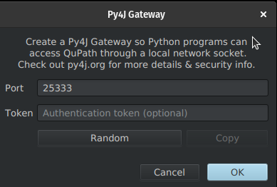

# QuPath Py4J extension addon 

Add several methods I found useful to [QuPath Py4J extension](https://github.com/qupath/qupath-extension-py4j)

Feel free to use it and many thanks for the great works of
[QuPath Py4J extension](https://github.com/qupath/qupath-extension-py4j) and
[Py4J](https://www.py4j.org/)


## Installation

Assuming your QuPath extension folder is at ~/QuPath/v0.5/extensions -
```bash
git clone https://github.com/qupath/qupath-extension-py4j-addon  
cd qupath-extension-py4j-addon
./gradlew clean
./gradlew build
./gradlew copyDependencies
cp ./build/libs/*.jar ~/QuPath/v0.5/extensions
```

## Usage

To start a Py4J gateway from QuPath, you can either click the Python icon on
the QuPath toolbar, or use the menu item
`Extension -> Py4J -> Start Py4J Gateway`.

This dialog allows you to specify the port used for the websocket connection,
and an optional authentication token:



Once a gateway is started, you can connect from a Python process using
[qubalab](https://github.com/qupath/qubalab/):

```python
from qubalab.qupath import qupath_gateway
gateway = qupath_gateway.create_gateway(port=25333)

gateway.getExtensionVersion() # query the verison of the QuPath Py4J extension
```

Further documentation can be found in the [qubalab project](https://github.com/qupath/qubalab/).

## Development

It's recommended to use the extension setup described in
[the QuPath extension template](https://github.com/qupath/qupath-extension-template?tab=readme-ov-file#set-up-in-an-ide-optional)
for this extension.

